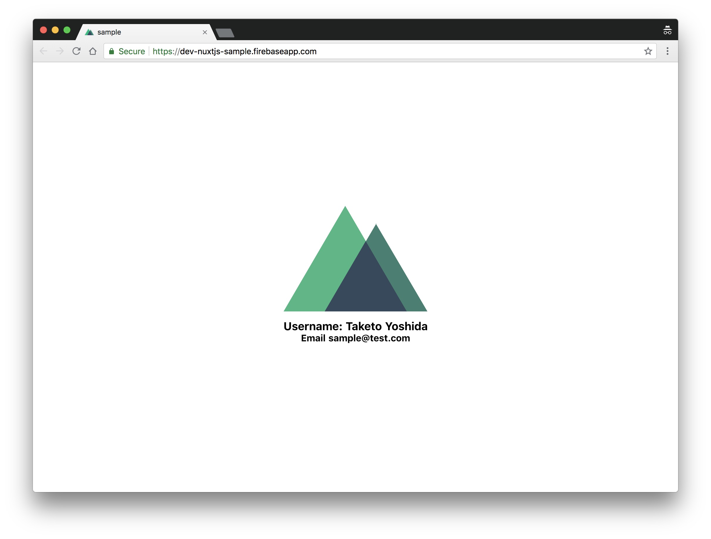

Firebase 上に SSR を使用した Nuxt.js と TypeScript で Web アプリを作成する上での知見を共有する。

#### この記事でわかる事

- TypeScript で Nuxt.js を書く方法
- Jest を利用した Nuxt.js のテスト
- Firebase で Nuxt.js のアプリを SSR (サーバサイドレンダリング) する方法
- Firebase の開発環境と本番環境の分け方

コードを見たほうが一目瞭然なので、まず先に GitHub へのリンクを載せておく。
<a href="https://github.com/tamanyan/nuxtjs-firebase" target="_blank">tamanyan/nuxtjs-firebase</a> を参考にしてくれれば良い。

作成した<a href="https://dev-nuxtjs-sample.firebaseapp.com/" target="_blank">サンプル Web アプリへのリンク</a>

<!--more-->

#### プロジェクトのディレクトリ構成
```
> tree -L 2 -I 'node_modules' .
.
├── app # App directory
│   ├── functions # Cloud Functions
│   └── nuxt # Nuxt.js
├── dist
│   └── functions # Output
├── firebase.json
├── package.json
├── public # Firebase Hosting
│   ├── assets # Nuxt.js assets
└── yarn.lock
```

Vuex からモックのユーザー情報（Username/Email）を取得して表示するアプリを作成した。



## Nuxt.js の TypeScript テンプレート

今回のサンプルアプリは Nuxt Community の TypeScript で書かれた Nuxt.js のテンプレートを使用した。
なお `vue-cil` 以下のように作成できる。

```bash
vue init nuxt-community/typescript-template nuxtjs-firebase
```

※ package.json を見ると TypeScript が 3 以上になっていないので、適宜修正する。

## TypeScript での Vuex の書き方

Vuex には既に TypeScript の型定義ファイルが存在するので、特に問題はない。
アプリがスケールする事を考え、`profile` という `module` を作成する事にする。

```bash
> tree app/nuxt/store
app/nuxt/store
├── index.ts
├── profile
│   ├── actions.ts
│   ├── getters.ts
│   ├── index.ts
│   ├── mutations.ts
│   └── types.ts
└── types.ts
```

#### app/nuxt/store/index.ts
```typescript
import Vuex, { StoreOptions } from 'vuex';
import { RootState } from './types';
import { profile } from './profile';

const storeOptions: StoreOptions<RootState> = {
  state: {
    version: '1.0.0' // a simple property
  },
  actions: {
    // nuxtServerInit({ commit }, { app }) {
    // }
  },
  modules: {
    profile
  }
};

export default () => new Vuex.Store<RootState>(storeOptions);
```

ユーザー情報を取得には本来であれば HTTP リクエストを呼ぶところだが、今回はモックデータを使用する。

#### app/nuxt/store/profile/actions.ts
```typescript
import { ActionTree, ActionContext } from 'vuex';
import { ProfileState, User } from './types';
import { RootState } from '../types';

export const actions: ActionTree<ProfileState, RootState> = {
  fetchData(context: ActionContext<ProfileState, RootState>): any {
    // Mock data
    const payload: User = {
      firstName: 'Taketo',
      lastName: 'Yoshida',
      email: 'sample@test.com'
    };

    context.commit('profileLoaded', payload);

    // Make http request in order to get user info instead of mock
  }
};
```

#### app/nuxt/store/profile/getters.ts
```typescript
import { GetterTree } from 'vuex';
import { ProfileState } from './types';
import { RootState } from '../types';

export const getters: GetterTree<ProfileState, RootState> = {
  fullName(state: ProfileState): string {
    const { user } = state;

    return `${user.firstName} ${user.lastName}`;
  }
};

```

#### app/nuxt/store/profile/mutations.ts
```typescript
import { MutationTree } from 'vuex';
import { ProfileState, User } from './types';

export const mutations: MutationTree<ProfileState> = {
  profileLoaded(state: ProfileState, payload: User) {
    state.user = payload;
    state.error = false;
    state.isReady = true;
  },
  profileError(state: ProfileState) {
    state.error = true;
    state.isReady = false;
  }
};
```

ProfileState の user を Optional にする事を最初に考えたが、上手く Observer が動作しないのが悲しい。

#### app/nuxt/store/profile/types.ts
```typescript
export interface User {
  firstName: string;
  lastName: string;
  email: string;
  phone?: string;
}

export interface ProfileState {
  user: User;
  isReady: boolean;
  error: boolean;
}
```

## Component と Vuex の書き方

[ktsn/vuex-class](https://github.com/ktsn/vuex-class) を使用するとデコレーターをつけて Vue のコンポーネントを作成できる。
慣れると問題はないのだが、これ Angular かな？と想いながら書いていて違和感満載だった。
デコレータを使用せずとも書くことができるので、そこは各々選択ではないかと思う。

#### app/nuxt/pages/index.vue
```html
<script lang="ts">

import AppLogo from '~/components/AppLogo.vue';
import UserProfile from '~/components/UserProfile.vue';
import { State, Action, Getter } from 'vuex-class';
import { Component, Vue } from 'nuxt-property-decorator';
import { ProfileState, User } from '~/store/profile/types';

const namespace: string = 'profile';

@Component({
  components: {
    AppLogo,
    UserProfile
  }
})
export default class extends Vue {

  @State('profile') profile: ProfileState;

  @Action('fetchData', { namespace }) fetchData: any;

  @Getter('fullName', { namespace }) fullName: string;

  mounted() {
    this.fetchData();
  }

  // computed variable based on user's email
  get email() {
    const { user } = this.profile;

    return user.email;
  }
}

</script>
```

## Nuxt.js のテスト

テストは [Jest](https://jestjs.io/) を使用して書いた。`new Builder(nuxt).build()` によって毎回ビルドが走るので、テストの実行が遅いのが難点。
なお [Testing - Nuxt.js](https://nuxtjs.org/examples/testing) を主に参考にした。

#### app/nuxt/\_\_tests\_\_/index.test.ts
```typescript
import { resolve } from 'path';
const { Nuxt, Builder } = require('nuxt');

jest.setTimeout(30000);

let nuxt = undefined;

beforeAll(async () => {
  const config = require('../nuxt.config.js');
  config.dev = false;
  config.rootDir = resolve(__dirname, '..');
  config.ssr = true;

  nuxt = new Nuxt(config)

  await new Builder(nuxt).build()
});

describe('Rendering test', () => {
  // Example of testing

  test('Route / exits and render HTML without error', async () => {
    const context = {};
    const { error } = await nuxt.renderRoute('/', context);

    expect(error).toBe(null);
  });
});

// Close server and ask nuxt to stop listening to file changes
afterAll(() => {
  nuxt.close();
});

```

## Cloud Functions を使用した Nuxt.js の SSR（サーバサイドレンダリング）

Cloud Functions 上に `ssr` という関数を作成する。SSR をするには Nuxt.js で作られたアプリをビルドし、出力したディレクトリを buildDir として設定する。
デプロイする JavaScript ファイルなどのプログラムは全て `dist/functions` 以下に出力するように設定しておく。 

#### app/functions/src/ssr.ts
```typescript
import * as express from 'express';
const { Nuxt } = require('nuxt');

const app = express();
const nuxt = new Nuxt({
    dev: false,
    buildDir: 'nuxt',
    build: {
      publicPath: '/assets/'
    }
});

app.use(nuxt.render);

export = app;
```

#### app/functions/src/index.ts
```typescript
import * as functions from 'firebase-functions';

export const ssr = functions.https.onRequest(require('./ssr'));
```

Firebase Hosting の設定で全てのリクエストで ssr を呼ぶようにする。

#### firebase.json
```json
{
  "hosting": {
    "public": "public",
    "ignore": [
      "firebase.json",
      "**/.*",
      "**/node_modules/**"
    ],
    "rewrites": [{
      "source": "**",
      "function": "ssr"
    }],
    "headers": [
      {
        "source" : "**/*.@(jpg|jpeg|gif|png|ico|webp)",
        "headers" : [ {
        "key" : "Cache-Control",
        "value" : "max-age=604800"
        } ]
      }, {
        "source" : "**/*.@(js|css)",
        "headers" : [ {
        "key" : "Cache-Control",
        "value" : "max-age=604800"
        } ]
      }
    ]
  },
  "functions": {
    "source": "dist/functions",
    "predeploy": "yarn build"
  }
}
```

## アプリの開発の流れ

Nuxt.js には開発用のコマンドが存在するので、Cloud Functions は基本的に開発時に使用する事はない。
以下のコマンドを入力すれば、フロントエンドのアプリが立ち上がるので、`http://localhost:3000` にアクセスすれば良い。

```bash
yarn dev
```

しかし SSR の挙動を確かめたい場合には、一度 Nuxt.js 側をビルドして `dist/functions` に吐き出し、Cloud Functions Emulator を立ち上げる。

```bash
yarn build # Build Nuxt app and Cloud Functions
yarn serve # Launch local emulator
```

## 開発・本番環境の分け方

基本的に同一アカウント内に開発環境 DevSampleApp と本番環境 SampleApp の両方を作成している。ステージング環境なども必要であれば適宜用意する。

```json
{
  "projects": {
    "default": "dev-sample-app",
    "production": "sample-app"
  }
}
```

CI/CD の時に環境を分けてテスト・デプロイできるようにしておく。

```json
{
  ...
  "scripts": {
    ...
    "use_dev": "firebase use default --token $FIREBASE_TOKEN",
    "use_prod": "firebase use production --token $FIREBASE_TOKEN"
  }
}
```

各環境ごとの環境変数は `.env.local` `.env.dev` `.env.prod` と .env ファイルを用意して対応した。

```javascript
require('dotenv').config()

module.exports = {
  env: {
    APP_ENV: process.env.APP_ENV || 'development',
    APP_BASE_URL: process.env.APP_BASE_URL || 'http://localhost:3000'
  },
  ...
}
```

## 悩みどころ

### Cloud Functions はアクセスがこないと Cold Start から始まるので、起動が遅い

Cloud Functions の起動がやけに遅くて、これ本番で大丈夫なの？と心配になっていた。SSR が遅いとページの表示が遅くなるので相当危うい事態になる。アクセスが増えると解決された。

### Blue-Green Deployment

デプロイ時のダウンタイムを無くしたいが、バージョンニングができないところが辛い。AWS Lambda だとできるみたいだが、その辺はきっと開発してくれると信じている。

[AWS Lambda Function Versioning and Aliases](https://docs.aws.amazon.com/lambda/latest/dg/versioning-aliases.html)

### Google Cloud Functions Emulator が Node 6 しか対応していない

Nuxt.js は version 1.0.0 以降から Node 8 以降しか対応していない。[Cloud Functions は Node 8 に対応できるようになった](https://cloud.google.com/functions/docs/concepts/nodejs-8-runtime)。しかし、ローカルでの開発をする上での [Google Cloud Functions Emulator](https://github.com/GoogleCloudPlatform/cloud-functions-emulator) が Node 6 しか対応していない（※ 2018/08/20 時点）。

> The Emulator only supports Node v6.x.x. It does not support Node v8.x.x or Python

それでも無理やり使用すると一応ちゃんと動作している。デプロイ後は Emulator を使用しないので、今のところ目をつむっている。

## Cloud Firestore との連携

[Cloud Firestore](https://firebase.google.com/docs/firestore/) との連携を考えるのであれば、おそらく Vuex の中で使用する事になるだろう。Cloud Firestore は非常に強力だが、マルチプラットフォームが当たり前になっている現代だとビジネスロジックを何度も書く事になる大変だ。**直接の使用は一部に留め、 API にラップして使用した方が良い**かもしれない。私の場合は Cloud Functions の中で呼ぶことが多い。バックエンドだけでしか呼ばないのであれば、もはや [Cloud Datastore](https://cloud.google.com/datastore/docs/concepts/overview) で良いのではないかと思うこともある。

## 参考URL

- [Vuex and Typescript – codeburst](https://codeburst.io/vuex-and-typescript-3427ba78cfa8)
- [Nuxt.jsとFirebaseでSPA×SSR×PWA×サーバーレスを実現する](https://inside.dmm.com/entry/2018/04/10/nuxt-firebase)
