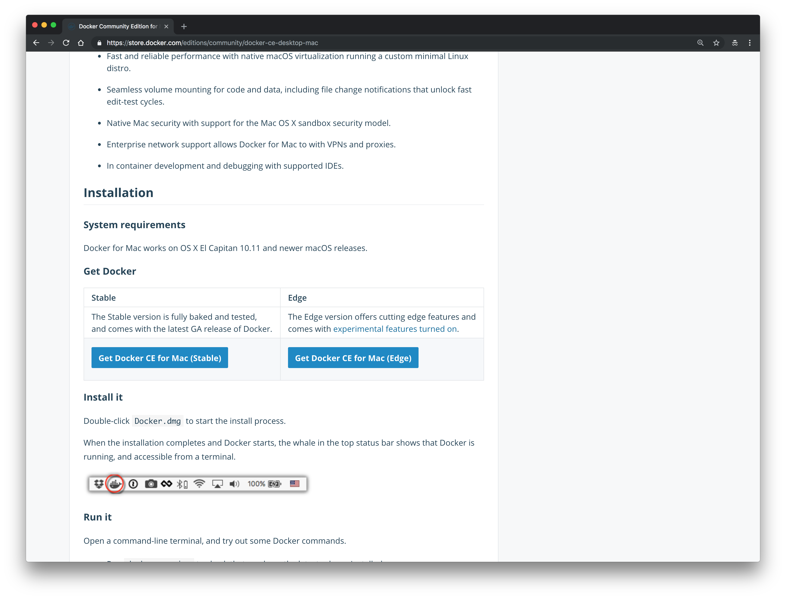
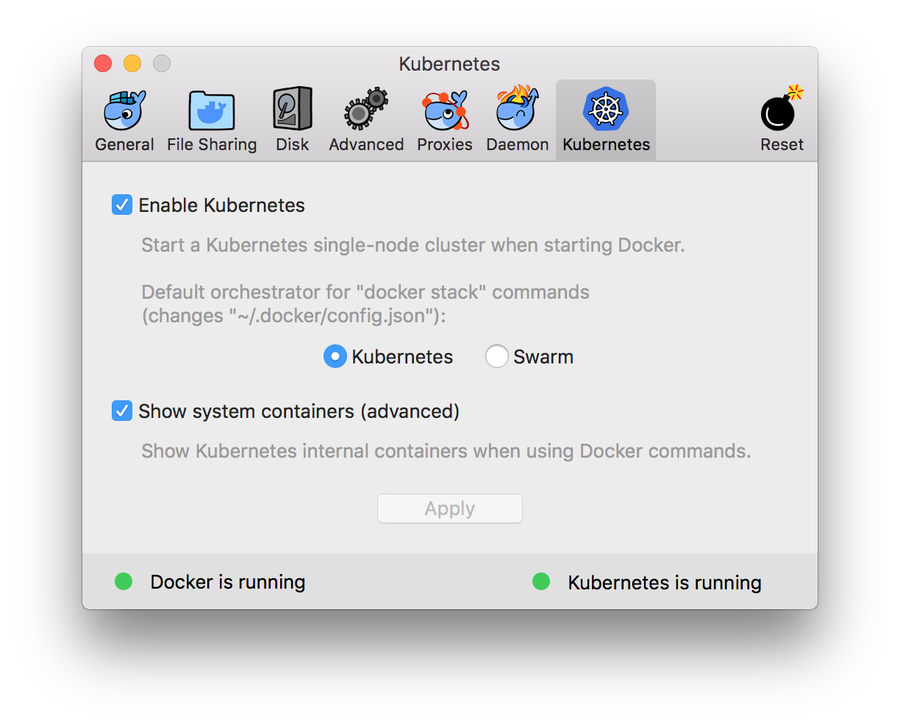
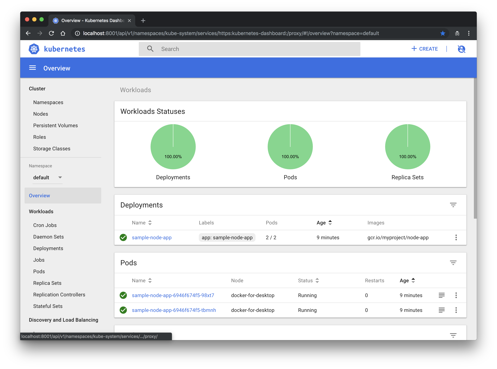
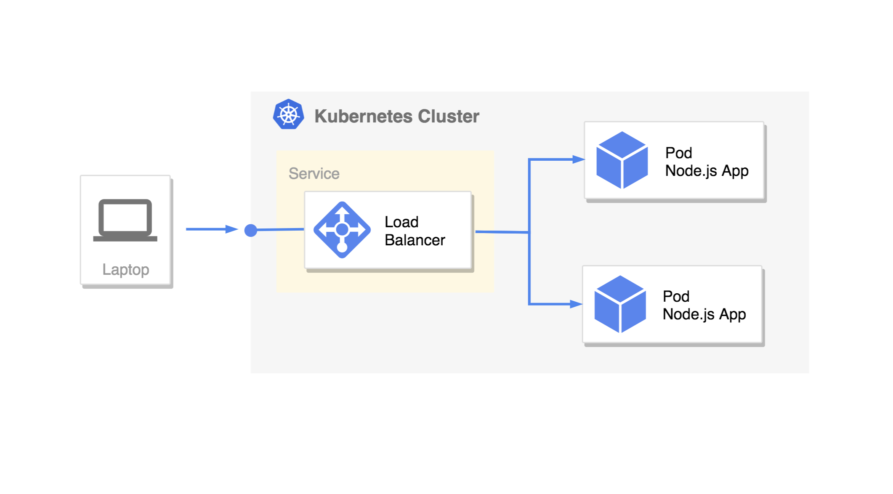
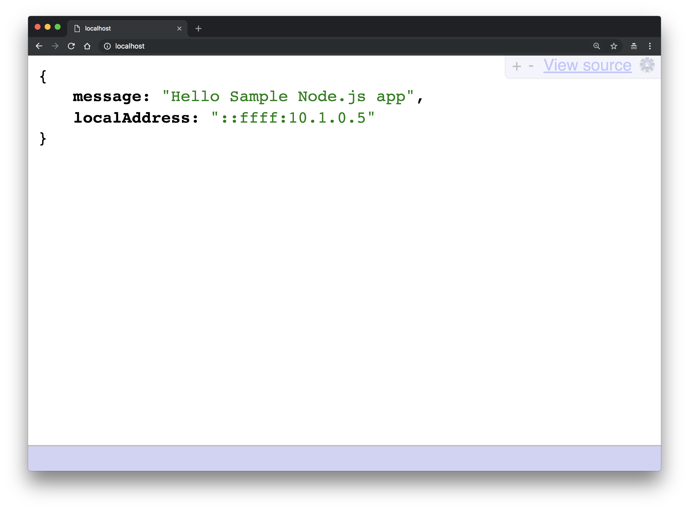

10分でローカルのKubernetesクラスタにNode.jsで構築したWeb Appをデプロイする。

#### この記事で分かる事

- Node.js Web AppをKubernetesクラスタ上に構築する方法
- Docker for Mac Kubernetesの使い方
- Kubernetes Dashboardのインストール方法

今回使ったサンプルは [tamanyan/k8s-node-sample](https://github.com/tamanyan/k8s-node-sample) にある。

## Kubernetes を知る

Dockerは触っていてもKubernetesは初めてという人は結構多いのではないだろうか？

「Kubernetesは、コンテナ化したアプリケーションのデプロイ、スケーリング、および管理を行うための、オープンソースのコンテナオーケストレーションシステムである」

と書かれていても全くピンと来ない。まずオーケストレーションってなんだよ、曲でも作るのか？と冗談のように考える人もいるだろう。

<!--more-->

[オーケストレーション (コンピュータ)](https://ja.wikipedia.org/wiki/%E3%82%AA%E3%83%BC%E3%82%B1%E3%82%B9%E3%83%88%E3%83%AC%E3%83%BC%E3%82%B7%E3%83%A7%E3%83%B3_(%E3%82%B3%E3%83%B3%E3%83%94%E3%83%A5%E3%83%BC%E3%82%BF))

> オーケストレーション（英: Orchestration）は、複雑なコンピュータシステム/ミドルウェア/サービスの配備/設定/管理の自動化を指す用語。

`Pod`, `Service`, `Node`など一般用語にもあるような独自の概念が出てきてイマイチとっつきにくいKubernetesを理解するために、
まず以下の Video を見て雰囲気を感じてもらいたい。 英語だが、字幕をつけて絵だけ見ていても雰囲気を感じ取れると思う。

<iframe width="560" height="315" src="https://www.youtube.com/embed/4ht22ReBjno" frameborder="0" allow="autoplay; encrypted-media" allowfullscreen></iframe>

## Docker for Mac をインストール

[Docker Community Edition for Mac](https://store.docker.com/editions/community/docker-ce-desktop-mac) に行き、以下の `Get Docker CE for Mac (Stable)` からダウンロードする。



## Kubernetes を有効にする

Docker アプリからPreferencesを開き、Applyを押して有効にする。



使用するClusterを`docker-for-desktop`に変更する。

```
$ kubectl config use-context docker-for-desktop
```

## Kubernetes Dashboard をインストール

Kubernetes Clusterの状態確認するためにWeb UI [kubernetes/dashboard](https://github.com/kubernetes/dashboard)をインストールする。

```bash
$ kubectl apply -f https://raw.githubusercontent.com/kubernetes/dashboard/master/src/deploy/recommended/kubernetes-dashboard.yaml
```

```bash
echo "apiVersion: rbac.authorization.k8s.io/v1beta1                                                                                                                                                       
kind: ClusterRoleBinding
metadata:
  name: kubernetes-dashboard
  labels:
    k8s-app: kubernetes-dashboard
roleRef:
  apiGroup: rbac.authorization.k8s.io
  kind: ClusterRole
  name: cluster-admin
subjects:
- kind: ServiceAccount
  name: kubernetes-dashboard
  namespace: kube-system" | kubectl apply -f -
```

```bash
$ kubectl proxy
```

以下のURLにアクセスする

http://localhost:8001/api/v1/namespaces/kube-system/services/https:kubernetes-dashboard:/proxy/



## Node.js Web AppをKubernetesクラスタにデプロイ

ようやく準備が完了したので、以下のアーキテクチャを構築を目標にする。今回は`Service`と`Deployment`のみを使用する。



### 1. サンプルプロジェクトをClone

#### サンプルプロジェクトをGithubからCloneする
```bash
$ git clone https://github.com/tamanyan/k8s-node-sample.git
```

#### プロジェクトのディレクトリ構成
```bash
$ tree -L 2 -I 'node_modules' .
.
├── Makefile # command list
├── README.md
├── k8s
│   ├── deployment.yaml # Kubernetes Deployment
│   └── service.yaml # Kubernetes Service
└── node-app
    ├── Dockerfile # Dockerfile for Node.js app
    ├── index.js
    ├── package-lock.json
    └── package.json
```

#### Dockerfile
```dockerfile
FROM node:8.12.0-alpine

ENV NODE_ENV=development

ARG project_dir=/app/

WORKDIR /app/

ADD index.js $project_dir
ADD package.json $project_dir
ADD package-lock.json $project_dir

RUN npm install

EXPOSE 3000

CMD ["npm", "start"]
```

#### index.js
```javascript
const express = require('express')
const app = express()
const port = process.env.PORT || 3000

app.get('/', (req, res) => {
  res.json({
    message: 'Hello Sample Node.js app',
    localAddress: req.connection.localAddress,
  });
})

app.listen(port, () => console.log(`Sample app listening on port ${port}!`))
```

### 2. Node AppのDocker Imageをビルド

```bash
$ make build
docker build --no-cache -t gcr.io/myproject/node-app:v1 node-app
```

### 3. Node Appのデプロイ

```bash
$ make deploy
kubectl apply -f k8s/deployment.yaml
deployment.apps/sample-node-app configured
kubectl apply -f k8s/service.yaml
service/sample-node-app-service configured
```

### 4. Node.js Web Appのデプロイ

http://localhost にアクセス



### 5. Node.js Web Appの削除

```bash
$ make clean
kubectl delete -f k8s/deployment.yaml
deployment.apps "sample-node-app" deleted
kubectl delete -f k8s/service.yaml
service "sample-node-app-service" deleted
```

## Kubernetesのマニフェストファイルの中身

#### deployment.yaml
```yaml
apiVersion: apps/v1beta1
kind: Deployment
metadata:
  name: sample-node-app
  labels:
    app: sample-node-app
spec:
  replicas: 2
  template:
    metadata:
      labels:
        app: sample-node-app
    spec:
      containers:
      - name: sample-node-app
        image: gcr.io/myproject/node-app:v1
        command:
        ports:
          - containerPort: 3000
```

#### service.yaml
```yaml
kind: Service
apiVersion: v1
metadata:
  name: sample-node-app-service
spec:
  type: LoadBalancer
  selector:
    app: sample-node-app
  ports:
  - protocol: TCP
    port: 80
    targetPort: 3000
```

## まとめ

今回はほぼ最小の構成でNode.js Web AppをKubernetesクラスタにデプロイした。`Deployment`と`Service`はKubernetes上に構築したアプリを公開するのに最も基礎的な事である。


## 参考URL

- [Kubernetes NodePort vs LoadBalancer vs Ingress? When should I use what?](https://medium.com/google-cloud/kubernetes-nodeport-vs-loadbalancer-vs-ingress-when-should-i-use-what-922f010849e0)
- [Deploy Go application to Kubernetes in 30 seconds](https://medium.com/google-cloud/deploy-go-application-to-kubernetes-in-30-seconds-ebff0f51d67b)
