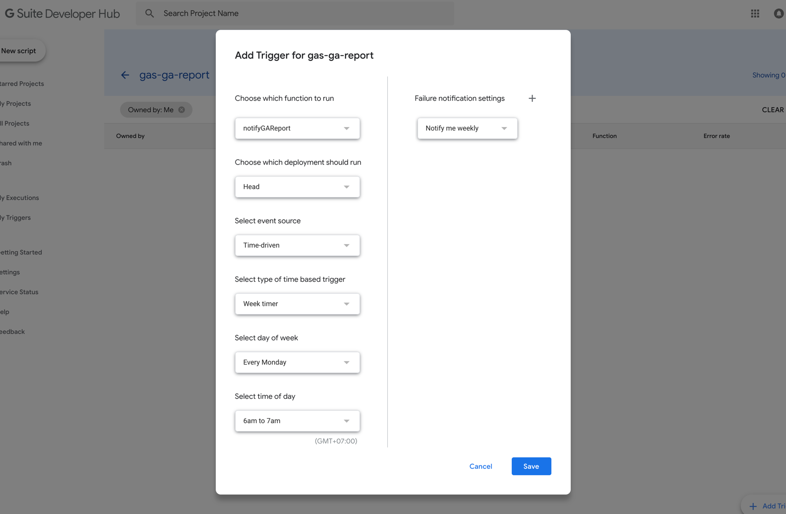

Google Apps Script と Google Charts を使って、チャート画像を生成、メールに添付し送信する手法を説明する。

#### この記事で分かる事

- clasp の使い方
- Google Charts を Google Apps Script から使用する方法
- Google Analytics のデータを Google Apps Script から引っ張ってくる方法
- E-Mail を Google Apps Script から送信する
- Google Apps Script を TypeScript で書く方法

完成形は以下な感じ

<!--more-->


## clasp で Google Apps Script のプロジェクトをセットアップ

[clasp](https://github.com/google/clasp) は Google Apps Script の Google 製の CLI ツール。
TypeScript で書きたい人なので、https://github.com/google/clasp/blob/master/docs/typescript.md を見て設定する。

## レポート通知の Google Apps Script を書く

```typescript
interface CharData {
  date: string
  pageviews: string
}

const colors = {
  blue: '#2196F3'
};

const dateFormat = (date: Date) => {
  const month = date.getMonth() + 1
  const day = date.getDate()
  const monthStr = month < 10 ? `0${month}` : month
  const dayStr = day < 10 ? `0${day}` : day

  return `${date.getFullYear()}-${monthStr}-${dayStr}`
}

const createReportChartBlob = (chartName: string, data: CharData[]): GoogleAppsScript.Base.Blob => {
  const dataTable = Charts.newDataTable()
    .addColumn(Charts.ColumnType.STRING, 'Month')
    .addColumn(Charts.ColumnType.NUMBER, 'Pageviews')
  const textStyle = Charts.newTextStyle().setFontSize(18).build();

  data.forEach((data: CharData) => {
    dataTable.addRow([data.date, data.pageviews])
  });

  const chart = Charts.newColumnChart()
    .setDataTable(dataTable)
    .setStacked()
    .setTitle('Pageviews (Last 7 days)')
    .setXAxisTitle('Date')
    .setXAxisTitleTextStyle(textStyle)
    .setYAxisTitle('The Number of Pageviews')
    .setYAxisTitleTextStyle(textStyle)
    .setDimensions(1000, 500)
    .setColors([colors.blue])
    .build();

  return Utilities.newBlob(chart.getAs('image/png').getBytes(), 'image/png', chartName)
}

const getHtmlBody = (reportChartName: string) => {
  return `<!DOCTYPE html>
  <html>
  <head>
    <meta http-equiv="Content-Type" content="text/html; charset=UTF-8">
    <meta name="viewport" content="width=device-width, initial-scale=1.0">
    <title>Test Report</title>
  </head>
  <body>
    <h2>Reporting</h2>
    
  </body>
</html>`;
};

function notifyGAReport() {
  try {
    const now = new Date()
    const aWeekAgo = new Date()

    aWeekAgo.setDate(aWeekAgo.getDate() - 7)

    const report = Analytics.Data.Ga.get(
      '<your-ga-tableid>', // ga:xxxxxxxxx
      dateFormat(aWeekAgo),
      dateFormat(now),
      'ga:pageviews',
      {
        dimensions: 'ga:yearMonth,ga:date',
        samplingLevel: 'DEFAULT',
        sort: 'ga:date'
      }
    )

    if (report.rows.length === 0) {
      Logger.log(`There is no data to create an report.`)

      return
    }

    const data: CharData[] = report.rows.map((row: string[]) => {
      return {
        date: row[1],
        pageviews: row[2]
      }
    })

    const inlineImages = {
      pageviews: createReportChartBlob('pageviews', data)
    };

    MailApp.sendEmail({
      to: '<your-email-address>',
      subject: `Google Analytics Reporting`,
      htmlBody: getHtmlBody('pageviews'),
      inlineImages: inlineImages
    });
  } catch (e) {
     Logger.log(`Failed to create an analytics report. Reason: ${e.message}`)
  }
}
```

## Trigger / Scheduler の設定


毎週月曜日の 6am - 7am の間に設定してみる。




## まとめ

今回は Google Analytics からデータを取得、チャート作成を行った。更に SpreadSheet や MySQL / Cloud SQL 等からのデータ取得が可能なほど、Google Apps Script の汎用性は高い。

## 参考URL

- [Analytics Service | Apps Script | Google Developers](https://developers.google.com/apps-script/advanced/analytics)
- [Class Chart | Apps Script | Google Developers](https://developers.google.com/apps-script/advanced/analytics)
