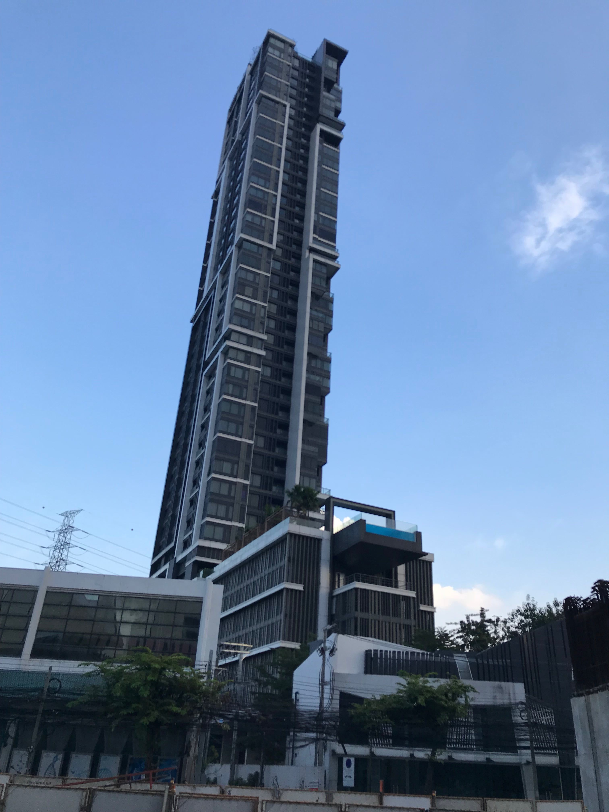

バンコクでソフトウェアエンジニアとして働き始めて約一年間経過した。この一年間行った事、バンコクの生活、感じた事を振り返る。

## 仕事について

一年前までは日本経済新聞社でiOSエンジニアをやっていた。[日経電子版アプリ](https://pr.nikkei.com/nikkei_app/)等をフルスクラッチで開発したりと、良い経験をさせてもらった。

なぜバンコクへ来たのか？日本人のソフトウェアエンジニアがバンコクで働く姿を想像できる人は少ないだろう。転職した経緯はバンコク駐在中の大学時代の友人からヘッドハントを受けたというシンプルなもの。仕事で英語を使いたい、ゼロからのプロジェクト立ち上げができる等、様々な理由はあったが、「バンコクに住むと楽しそう」と当時の私は考え、そのオファーを受理した。

<!--more-->

今の仕事では主にデータサイエンティスト＆エンジニアをやっている。Arm Treasure Dataを使ったデータ基盤構築、機械学習を使った購入予測モデルの構築等エンジニアとして新しい経験ができている。また、Arm Treasure Dataのイベントで登壇させてもらったりと一定の成果も出つつある。

この一年間は所謂一人エンジニアで何でもやっていた。最近は筋が良いタイ人エンジニアも増えてきて、EM（エンジニアリングマネージャー）としても期待されてつつある。一人では労力が足りないと考えていた事も実現できる基盤が整ってきた。

## バンコクの生活について

バンコクは南国だ。昼の気温は常に30度を超えていて、一年中プールに入れるほど。一部の人には大事な事だが花粉症で苦しむ事はないらしい。

タイ料理は世界的にも認められており、トムヤムクンは世界の三大スープとも言われている。住む地域にもよるが、日本食で困る事はない。[とん清](https://thaisharehouse.com/tonsei-dinner)の納豆定食は神と表現して良い。また、至るところに日本のチェーン店（吉野家・大戸屋等）があり、タイ料理が苦手でも問題はない。もちろんお値段は日本と同じだ。人によっては日本食しか食べない人もいる。

住環境は日本と同等の収入レベルがあれば格段に良くなる。少し中心街を避ければ5 ~ 7万円で30階以上建て高層コンドミニアムに住める（1 Bedroom）。プール・ジム付きは基本、夜間でも警備員が配置されていて、セキュリティ面は安全。格安で「タワマン住んでいます」という承認欲求を満たす事ができる。

気になる生活費だが、この一年間家計簿をつけていたところ、一人暮らしで一ヶ月は平均 14 万円程度。私の中での物価は東京＞バンコク＞地方の感覚。バンコクの生活費は上下に振れ幅が大きく、質素に暮せばもっと支出は減らせるし、贅沢に暮せばいくらでも出費できる。生活費なんて人によるだろうから、参考程度にしてもらいたい。

住んでいて不便な点は、交通渋滞、歩道が整備が甘い、下水の匂いが臭い場所がある等。バンコクでさえも所々で発展途上国を感じる事がある。

## バンコクのエンジニアの相場について

バンコクのソフトウェアエンジニアの相場はLinkedinのエージェントの求人情報から察すると、シニアクラスの月給でupto 100k THB、up to 80k THB程（ボーナスについては不明）。タイバーツを3.4円にすると **27 万円 ~ 34万円**まで。

東京で活躍しているソフトウェアエンジニアがこの月給帯で当然来るはずもない。しかし、バンコクには数多くの日系企業があり、日本人プレゼンスが働く事がある。バンコクでエンジニアを採用したいが、見つからずに日本から探してくるという話も聞く。私も当然高い評価を受けた結果こちらに来た。しかしながら、まだこの動きは小さなものでしかない。[GAOGAO](https://gaogao.asia) を始めとして、徐々に日本人のエンジニアコミュニティも広がりつつある。バンコクに来る日本人エンジニアが増えて、より活発になると嬉しい。

## 最後に

自分にとって海外勤務も海外生活も初めての事ではあるが、現地の日系外資企業という事で日本人が働きやすい環境であり、頭が良い人も多いので、さほど困った事は起きていない。チャット、メール、資料は全部英語で書くようになったし、自分で表現できる範囲で英語を使い議論する事も増えている。当初の考えていた通りに仕事できているところもあるが、駐在員という立場ではない故に「いつまでバンコクで働くべきだろうか」という別の悩みも抱えつつ、答えのない問題を探し続けている。キャリアパスは自分で切り開くもので、今後も自分が輝ける場所で仕事をしていきたい。
