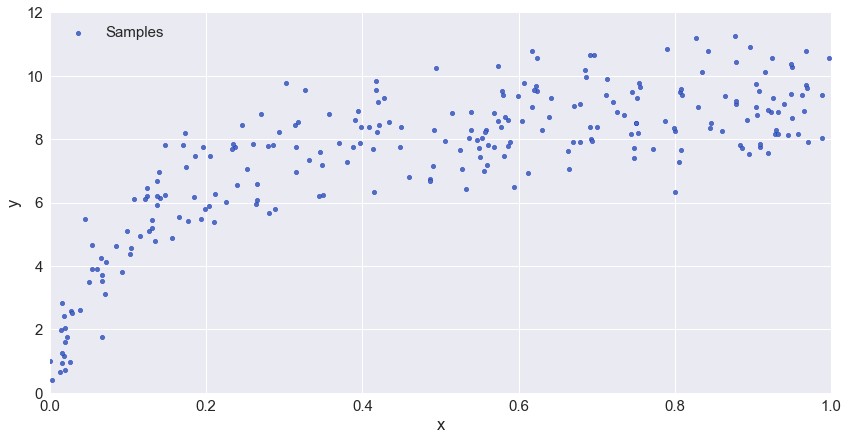
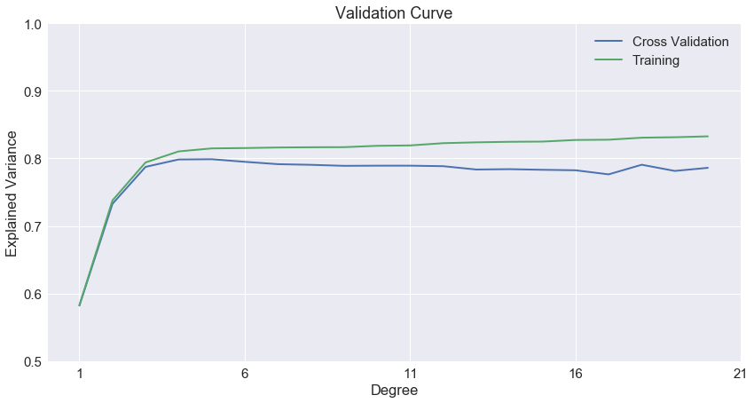

線形回帰を用いて過学習（オーバーフィッティング）と未学習（アンダーフィッティング）について学ぶ。

## 線形回帰と過学習と未学習

線形回帰とは入力$X$に対して入力に合うような$θ$を決定する事である。ここでは、一次元の入力サンプルデータに対して、単回帰・多項式回帰を用いて、予測モデルを作成してみる。

$$
h_θ(X) = θ_0 x_0 + θ_1 x_1 + ... + θ_n x_n = θ^T X
$$

scikit-learnの `LinearRegression` 線形回帰を使って、それぞれ1次、4次、16次多項式関数の`Model`を求めた。また、`Samples`のデータは以下の関数で生成される。なお、サンプルデータは以下の関数で出力される。


```python
def rand_func(x, error=0.5, random_state=0):
    '''Return y'''
    np.random.seed(random_state)
    return np.random.normal(10 - 1. / (x + 0.1), error) # mean (平均値), standard deviation (標準偏差)
```

<!--more-->

1番目のモデルはシンプルだが、サンプルデータに対してフィットしていない。単回帰つまり1次関数では直線しか引けないのでこのデータの分布にはフィットしない。この状態を**未学習（underfitting / high-bias）**と呼ぶ。

2番目のモデルはこの中では最もサンプルデータにフィットしているように見える。

3番目のモデルはサンプルデータに対してフィットしているように見えるが、未知のデータに対しての予測には適応できそうもない。この状態を**過学習（overfitting / high variance）**と呼ぶ。

汎化性能（未知のデータへの予測）が高いモデルを作成するには、未学習と過学習が起きていないかを確認する必要がある。

```python
error = 1.0
n_samples = 30
np.random.seed(1)
X = np.random.random(n_samples)
y = rand_func(X, error)

degrees = [1, 5, 15]

plt.figure(figsize=(15, 5))

for i in range(len(degrees)):
    polynomial_features = PolynomialFeatures(degree=degrees[i],
                                             include_bias=False)
    linear_regression = LinearRegression()
    pipeline = Pipeline([("polynomial_features", polynomial_features),
                         ("linear_regression", linear_regression)])
    pipeline.fit(X.reshape(-1, 1), y)

    scores = cross_val_score(pipeline, X.reshape(-1, 1), y,
                             scoring="neg_mean_squared_error", cv=5)

    X_test = np.linspace(0, 1, 100)

    ax = plt.subplot(1, len(degrees), i + 1)
    ax.plot(X_test, pipeline.predict(X_test.reshape(-1, 1)), label="Model")
    ax.scatter(X, y, edgecolor='b', s=20, label="Samples")
    plt.xlabel("x")
    plt.ylabel("y")
    plt.xlim((0, 1))
    plt.ylim((0, 12))
    plt.legend(loc="best")
    plt.title("degree={}\nMSE = {:.2e}(+/- {:.2e})".format(
        degrees[i], -scores.mean(), scores.std()))
    plt.tight_layout()

plt.show()
```


## scikit-learn を用いて線形回帰における未学習と過学習を表現する
### サンプルデータを作成

使用する関数は先程と同じ。250個データを用意する。これらを多項式の線形回帰

```python
# Load Sample Data
error = 1.0
n_samples = 250
np.random.seed(1)
X = np.random.random(n_samples)
y = rand_func(X, error)

plt.figure(figsize=(14, 7))
plt.scatter(X, y, edgecolor='b', s=20, label="Samples")
plt.xlabel("x")
plt.ylabel("y")
plt.xlim((0, 1))
plt.ylim((0, 12))
plt.legend(loc="best")
```



### Validation Curve

1次から21次多項式まで線形回帰モデルを変化させた際の訓練データのスコア（Training Score）と交差検証のスコア（Cross Validation Score）を描く。次数（Degree）が大きくなるにつれて、訓練データのスコアは増加しているが、交差検証のスコアは伸びるどころかむしろ悪化している。交差検証は汎化性能を検証するための手法で、ここでは詳しく説明はしないが、**訓練データに過剰にフィットして、汎化性能が悪化している**と理解できれば良い。



```python
degrees = np.arange(1, 21)

model = make_pipeline(StandardScaler(),
                      PolynomialFeatures(),
                      LinearRegression())

train_scores, validation_scores = validation_curve(
                 model, X.reshape(-1, 1), y,
                 param_name='polynomialfeatures__degree',
                 param_range=degrees, cv=5)

plt.figure(figsize=(14, 7))
plt.plot(degrees, validation_scores.mean(axis=1), lw=2,
         label='Cross Validation')
plt.plot(degrees, train_scores.mean(axis=1), lw=2, label='Training')
plt.xlabel('Degree')
plt.ylabel('Explained Variance')
plt.title('Validation Curve')
plt.xticks([1, 6, 11, 16, 21])
plt.ylim((0.5, 1))
plt.legend(loc='best')
```

### Learning Curve

特定の次数（1, 5, 15）だけを抽出し、それぞれのデータ数に対して、訓練データのスコア（Training Score）と交差検証のスコア (Cross Validation Score) がどのように変化するかを見る。次数1の時は訓練データのスコアと交差検証のスコアともに低い（Underfitting）。次数5の時は訓練データのスコアと交差検証のスコアの誤差が小さく、スコアも次数1の時に比べて高い。次数15の時は訓練データのスコアと交差検証のスコアの誤差が大きく、次数5の時に比べて交差検証のスコアが低い（Overfitting）。この中では次数5が最もデータにフィットしていると見なして良い。**訓練データのスコアと交差検証のスコアを比較して、未学習や過学習が起きていないかを確認する事が重要だ**。


```python
degrees = [1, 5, 15]

plt.figure(figsize=(15, 5)
for i in range(len(degrees)):
    d = degrees[i]
    model = make_pipeline(StandardScaler(),
                          PolynomialFeatures(degree=d),
                          LinearRegression())

    train_sizes, train_scores, validation_scores = learning_curve(
        model, X.reshape(-1, 1), y,
        train_sizes=np.logspace(-1, 0, 20), cv=5)

    ax = plt.subplot(1, len(degrees), i + 1)
    ax.plot(train_sizes, validation_scores.mean(axis=1),
            lw=2, label='Cross Validation')
    ax.plot(train_sizes, train_scores.mean(axis=1),
            lw=2, label='Training')
    plt.xlabel('The number of train samples')
    plt.ylabel('Explained Variance')
    plt.title('degree=%i\nLearning Curve' % d)
    plt.ylim((0, 1))
    plt.legend(loc='best')
    plt.tight_layout()

plt.show()
```

### まとめ

過学習と未学習についてscikit-learnと線形回帰を使って解説した。線形回帰の場合で過学習を抑制するには、ラッソ回帰（Lasso）、リッジ回帰（Ridge）など正則化を行うモデルを使用するのが良い。
