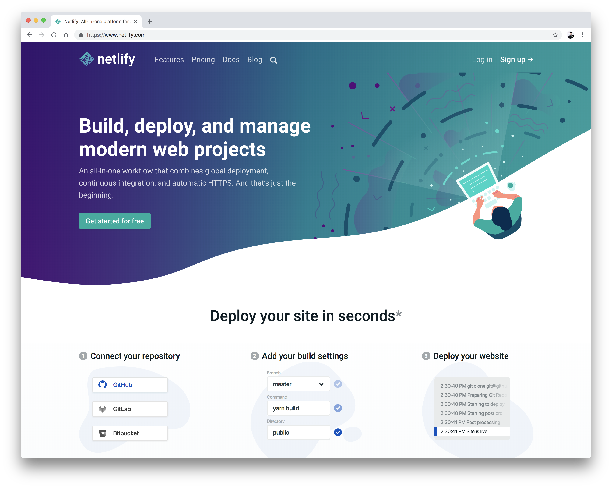
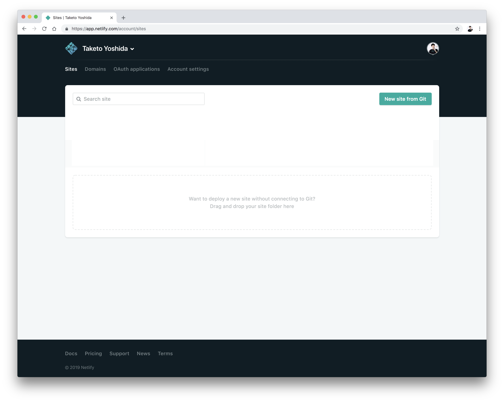
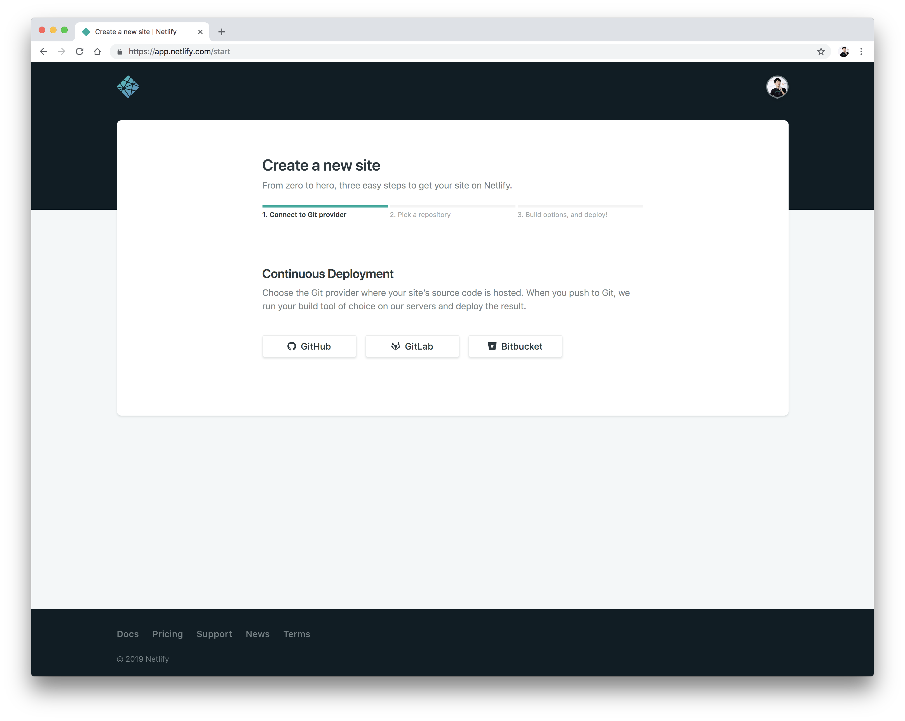
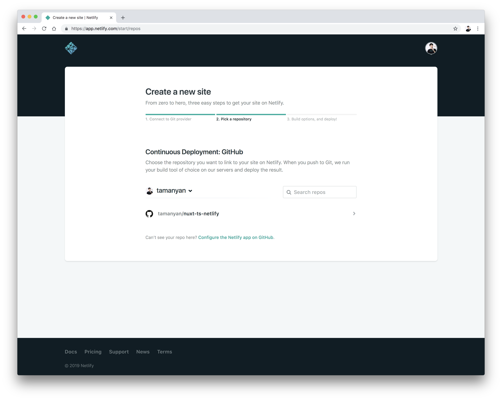
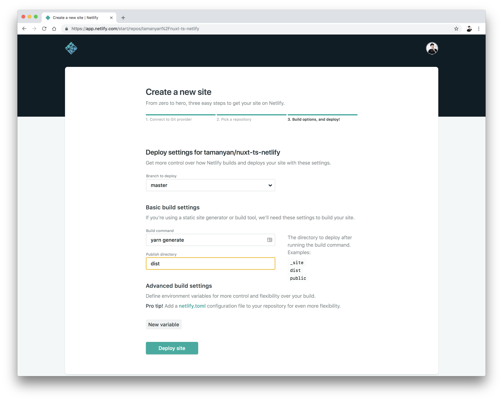
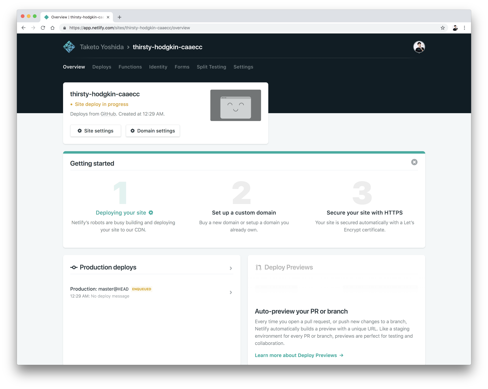
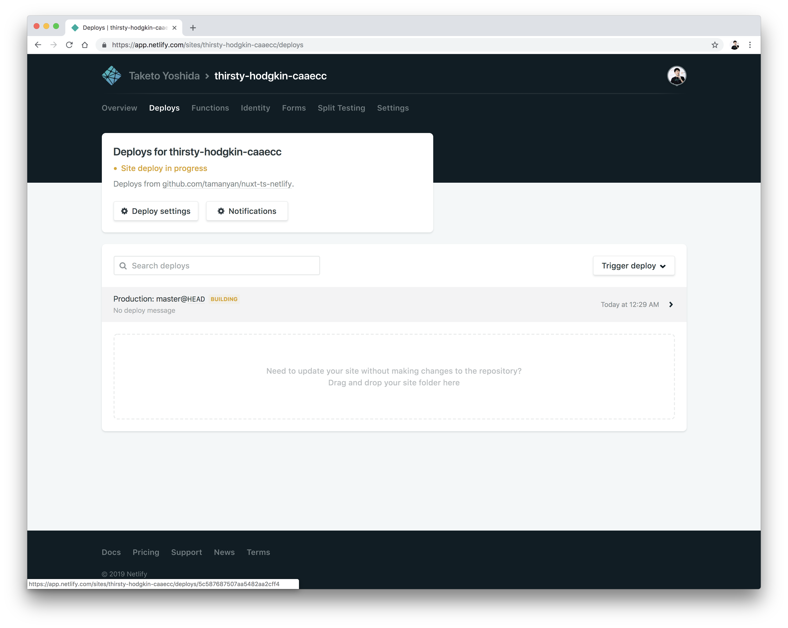
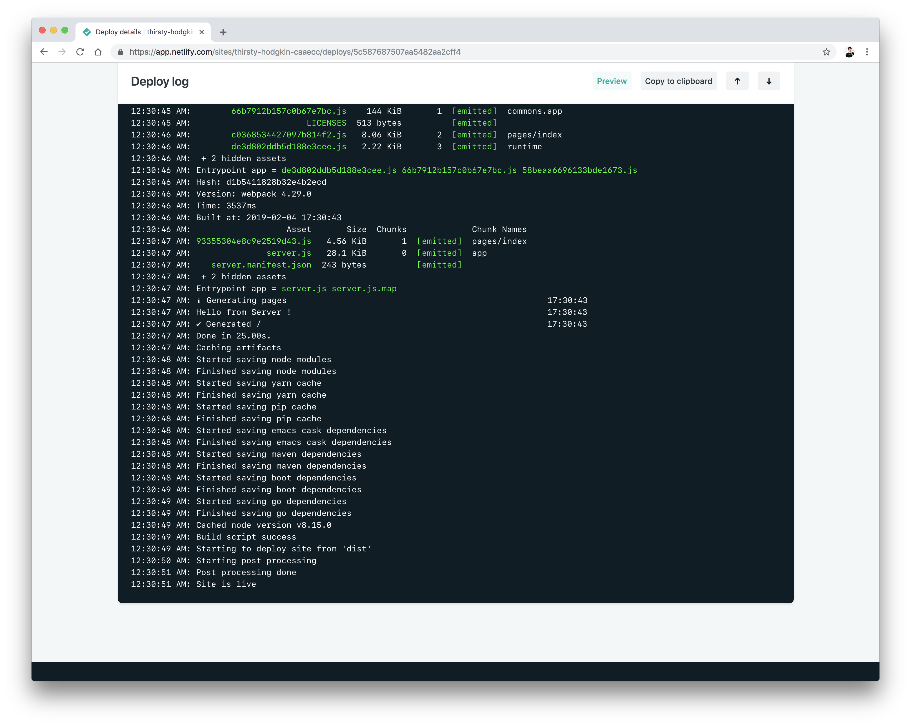
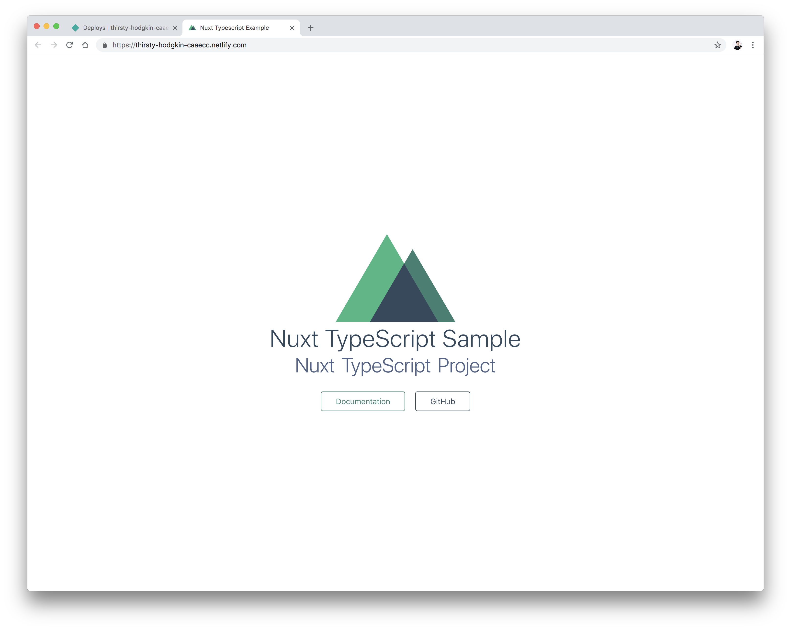

最近[JAMStack](https://jamstack.org/)に関して調べる事が多く、[Netlify](https://www.netlify.com/)の簡単さに感動したので紹介する。Nuxt.jsは動的Webサイトでも利用される事も多いが、静的Webサイトジェネレーターとしても優秀で柔軟性がある。今回はNuxt.jsが[正式なTypeScriptサポートがアナウンス](https://github.com/nuxt/nuxt.js/releases/tag/v2.4.0)されたので、`nuxt-ts`を用いて、GithubのプロジェクトをNetlifyにページ公開する所まで辿る。

## Netlifyとは？

静的WebサイトホスティングサービスのSaaS。Github/GitLab連携、自動ビルド・デプロイ、Functions、A/B Testingなど様々な機能がAll-In-Oneで入った凄いやつ。

<!--more-->



## Nuxt TypeScriptのサンプルプロジェクトをClone

既にサンプルは用意したので、以下のレポジトリからCloneするかForkして、Github上にプロジェクトを作っておく。

<div class="article-widget">
  <a class="article-widget-image" href="https://github.com/tamanyan/nuxt-ts-netlify" style="background-image: url('https://avatars0.githubusercontent.com/u/2387508?s=460&v=4');" target="_blank">
  </a>
  <a href="https://github.com/tamanyan/nuxt-ts-netlify" target="_blank">
    <strong class="article-widget-title">tamanyan/nuxt-ts-netlify: Nuxt TypeScript on Netlify</strong>
    <em class="article-widget-description">Nuxt TypeScript on Netlify. Contribute to tamanyan/nuxt-ts-netlify development by creating an account on GitHub.</em>
    <em class="article-widget-url">github.com</em>
  </a>
</div>

```bash
git clone https://github.com/tamanyan/nuxt-ts-netlify.git <project-name>
cd <project-name>
yarn or npm install
```

## GitHubからNetlifyプロジェクト作成

`New site from Git`ボタンからプロジェクトを作成。



## デプロイしたいWebサイトのレポジトリをGitHubから選択

Githubを選択して、自分がデプロイしたいプロジェクトを選択する。



自分で作成したNuxt TypeScriptのプロジェクトを選択する。



## Netlify上にWebサイトをビルド

以下の三点を設定する

- ビルドするブランチ
- 静的Webサイトをビルドするコマンドを設定。ここでは`yarn generate`
- ビルド先のディレクトリを指定。ここでは`dist`

追加のビルド設定だと、環境変数なども組み込めるようだ。



正直に書いてて言うのも何だが簡単なので、この指示を見なくとも殆どの人が作成できるだろう。

## Webサイトが公開されているかを確認する

次はプロジェクトのトップページに飛ぶので、 `Deploys`のタブを選択して、ビルド及びデプロイ状況を確認する。



Netlifyはブランチへのプッシュごとに自動ビルド・デプロイが走るので、CI/CDサービスと連携する必要がない。普通だとCI/CDサービスにデプロイ用のCLIツールをインストールして、コンフィグyamlファイルにコマンドを書いて、アクセスキーとなる環境変数を設定するなど意外と面倒くさい事が待っているが、Netlifyではそれらの事を全くしなくとも良い。



先程設定した、ビルドコマンドが走ってるのが見える。ビルドが終わったら、もう公開準備は終了。



このあとトップページに行くと、公開URLが見えているので、それをクリックすると終わり。わーすごい簡単。頭が馬鹿になりそう。完成したサンプルは[ここのURL](https://thirsty-hodgkin-caaecc.netlify.com/)に置いておく。



## 最後に

私がNetlifyに感動したのはJAMStackなアプリ、静的Webサイト+マイクロAPIでサービスを組む上でこれ程、丁度良いサービスが揃っているのは見たことなかった。あまりにも簡単でブログにまとめるほどの事なのだろうか？若干気を揉んだが、ここで終わりでは面白くないので、次回は`Split Testing`や`Functions`を試してみる。
