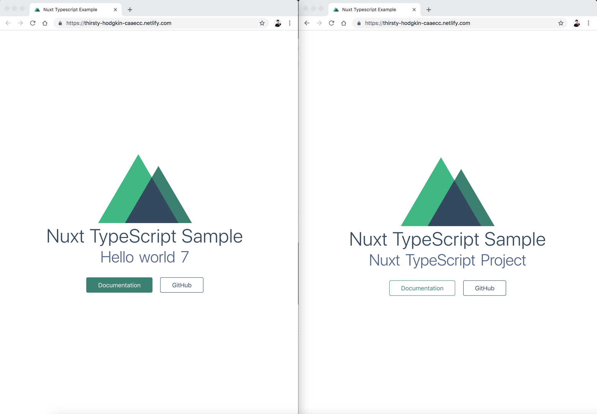
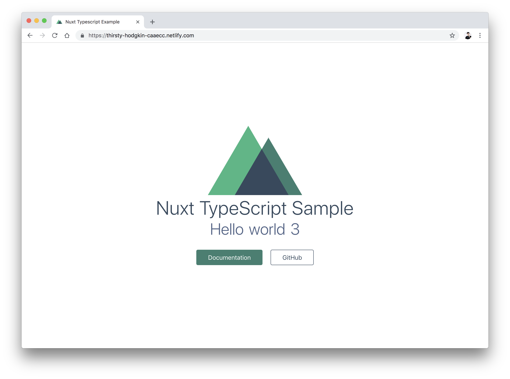
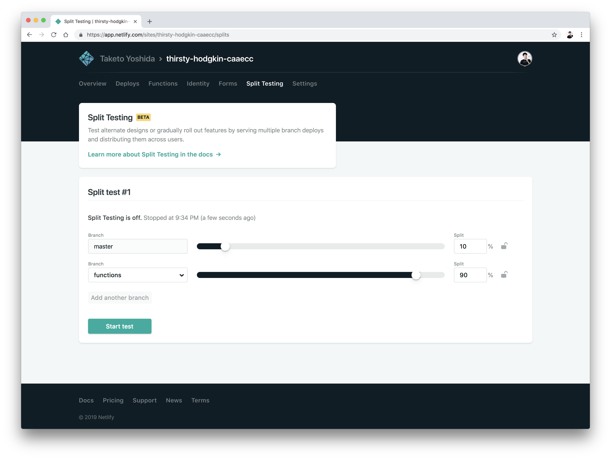

[JAMStack](https://jamstack.org/)なアプリを開発するには動的コンテンツの表示も可能にしなくてはならない。そのためにはマイクロAPIからデータを取得してくる必要がある。Netlifyはその機能を実現するために[Functions](https://www.netlify.com/docs/functions/)を機能として備えている。また、Netlifyはサードパーティのライブラリをインストールすることなく[Split Testing](https://www.netlify.com/docs/split-testing/)でA/Bテストを行う事ができる。しかもGitのブランチレベルでのトラフィックの振り分けが可能だ。

Netlifyのチュートリアルについて知りたければ以前の[Nuxt.js (TypeScript) on Netlifyの良さを広めたい](/nuxt-ts-netlify/)の記事を参照してほしい。

<!--more-->

#### 目次
1. <a href="#netlify-functionsとは">Netlify Functionsとは</a>
2. <a href="#netlify-split-testingとは">Netlify Split Testingとは</a>
3. <a href="#nuxt-typescriptのサンプルプロジェクトをclone">Nuxt TypeScriptのサンプルプロジェクトをClone</a>
4. <a href="#netlify-lambdaのインストール">netlify-lambdaのインストール</a>
5. <a href="#functionsをtypescriptで書く">FunctionsをTypeScriptで書く</a>
6. <a href="#nuxtjsからfunctionsの呼び出し">Nuxt.jsからFunctionsの呼び出し</a>
7. <a href="#split-testingでabテストをやってみる">Split TestingでA/Bテストをやってみる</a>
8. <a href="#最後に">最後に</a>

## Netlify Functionsとは

裏はAWS Lambdaになっているようだが、我々が特にAWSを意識する事はない。価格は公式から引用させてもらうと

> All Netlify sites include 125,000 function requests per month, and 100 hours of run time per month. Above that, billing scales with your usage.

<span class="strong">125,000リクエスト/月、実行時間が100時間まで無料</span>らしい。あとは従量課金制だ。個人的にAWS LambdaやCloud FunctionsはGB秒という確保するメモリと実行時間を合わせた単位で課金されるので、あまり直感的ではないが、Netlify Functionsはリクエスト数と実行時間のみで課金されるようだ。

## Netlify Split Testingとは

段階的ロールアウトやA/B TestingなどUIから簡単に設定できる機能。まだBETA（Feb 5 2019時点）だが、個人的に今回一番推したい機能。



## Nuxt TypeScriptのサンプルプロジェクトをClone

既にサンプルは用意したので、以下のレポジトリからCloneするかForkして、Github上にプロジェクトを作っておく。masterではなく、<span class="strong">functionsのブランチを今回利用するので注意</span>。

<div class="article-widget">
  <a class="article-widget-image" href="https://github.com/tamanyan/nuxt-ts-netlify/tree/functions" style="background-image: url('https://avatars0.githubusercontent.com/u/2387508?s=460&v=4');" target="_blank">
  </a>
  <a href="https://github.com/tamanyan/nuxt-ts-netlify/tree/functions" target="_blank">
    <strong class="article-widget-title">tamanyan/nuxt-ts-netlify at functions</strong>
    <em class="article-widget-description">Nuxt TypeScript on Netlify. Contribute to tamanyan/nuxt-ts-netlify development by creating an account on GitHub.</em>
    <em class="article-widget-url">github.com</em>
  </a>
</div>

```bash
git clone https://github.com/tamanyan/nuxt-ts-netlify.git <project-name>
cd <project-name>
yarn or npm install
```

## netlify-lambdaのインストール

関数の実行やビルドなどしたい場合は[netlify/netlify-lambda](https://github.com/netlify/netlify-lambda)が便利。TypeScriptのビルドなども対応しているようだ。サンプルプロジェクトでは全て設定が完了しているので特に何もする必要はない。念の為`netlify.toml`の設定部分に関してのみ説明しておくと、`command`はビルドコマンド、`functions`にLambda関数を置いておくようにする。`publish`は公開ディレクトリ。

```
# example netlify.toml
[build]
  command = "yarn generate" # generate cmd
  functions = ".lambda" # netlify-lambda reads this
  publish = "dist" # The directory you want to publish
```

## FunctionsをTypeScriptで書く

`functions`の`hello.ts`にLambda関数を書く、ビルドすると`.lambda`に出力されるようになっている。

#### functions/hello.ts
```typescript
import { Handler, Context, Callback, APIGatewayEvent } from 'aws-lambda'

interface HelloResponse {
  statusCode: number
  body: string
}

export const handler: Handler = (
  event: APIGatewayEvent,
  context: Context,
  callback: Callback
) => {
  const params = event.queryStringParameters
  const response: HelloResponse = {
    statusCode: 200,
    body: JSON.stringify({
      msg: `Hello world ${Math.floor(Math.random() * 10)}`,
      requestId: context.awsRequestId || "dummy",
      params
    })
  }

  callback(undefined, response)
}
```

## Nuxt.jsからFunctionsの呼び出し

ローカルでも呼び出せるように`axios`と`proxy`の設定をしておく。Nuxt.jsはポート3000で立ち上がるが、ローカルでnetlify-lambdaを使って関数を立ち上げると9000で起動するので、proxyを通しておくと便利。

#### nuxt.config.ts
```typescript
  /*
   ** Nuxt.js modules
   */
  modules: [
    // Doc: https://github.com/nuxt-community/axios-module#usage
    '@nuxtjs/axios',
    '@nuxtjs/proxy'
  ],
  /*
  ** Axios module configuration
  */
  axios: {
    proxy: true // Can be also an object with default options
  },

  proxy: {
    '/.netlify/': { target: 'http://localhost:9000/' }
  },
```

ここでは、Functionsが呼び出せるかどうかだけを確かめるために`mounted`で直接APIを叩いて関数を呼び出す。

#### src/pages/index.vue
```typescript
<template>
  <section class="container">
    <div>
      <logo />
      <h1 class="title">
        Nuxt TypeScript Sample
      </h1>
      <h2 class="subtitle">
        {{ subtitle }}
      </h2>
      <div class="links">
        <a
          href="https://nuxtjs.org/"
          target="_blank"
          class="button--green"
        >Documentation</a>
        <a
          href="https://github.com/nuxt/nuxt.js"
          target="_blank"
          class="button--grey"
        >GitHub</a>
      </div>
    </div>
  </section>
</template>

<script lang="ts">
import { Component, Vue } from 'vue-property-decorator'
import Logo from '../components/Logo.vue'


@Component({
  components: {
    Logo,
  }
})
export default class Index extends Vue {

  subtitle: string = 'Nuxt TypeScript Project!'

  async mounted() {
    // Call Netlify Functions
    const response = await this.$axios.$get('./.netlify/functions/hello')

    // Set subtitle from message
    this.subtitle = response.msg
  }
}
</script>
```

元々は`Nuxt TypeScript Project!`が表示されていたが、APIのレスポンスから`msg`を取得してHello World \<number\> になっている。



## Split TestingでA/Bテストをやってみる

masterとfunctionsの両方のブランチを使ってA/Bテストをやってみる。使い方は直感的で迷う事はない。ここではmasterに10%、functionsに90%振り分けてみる。



細かい部分として、今訪問者がどのブランチで出力されているのかを環境変数から取得することができる。これらはGoogle Analyticsなどの計測に使える。

#### nuxt.config.ts
```typescript
export default {
  env: {
    BRANCH: process.env.BRANCH || 'undefined'
  }
```

#### src/pages/index.vue
```typescript
export default class Index extends Vue {

  subtitle: string = 'Nuxt TypeScript Project!'

  async mounted() {
    // Call Netlify Functions
    const response = await this.$axios.$get('./.netlify/functions/hello')

    // Set subtitle from message
    this.subtitle = response.msg

    // Show current branch
    console.log('Your branch is', process.env.BRANCH)
    // -> master or functions
  }
}
```

## 最後に

NetlifyのFunctionsとSplit Testingを使って、A/Bテストまで試してみた。個人的な感想として、<span class="strong">NetlifyはCDNにいろいろとサービスがくっついただけで、自動ビルド・デプロイ、Functions、Split Testingを使う程度ではNetlifyへのサービスロックインにはなりにくい</span>。Netlify Functionsは裏がAWS Lambdaで移植性は高い（AWS Lambdaへのロックインはしょうがない）。A/Bテストに関してはアプリケーションのソースコードレイヤーのレベルではないため問題ない。安い（or 無料）だし、悩むくらいなら始めてみようぜといえるサービスになっている。
