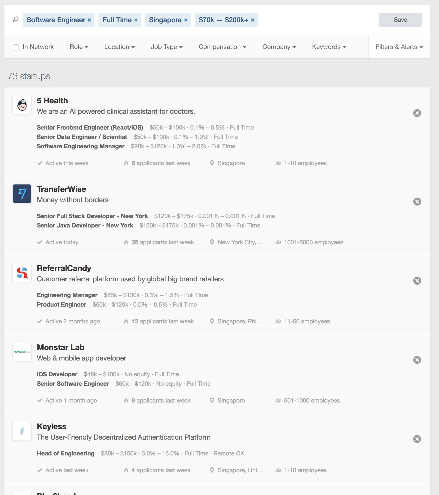
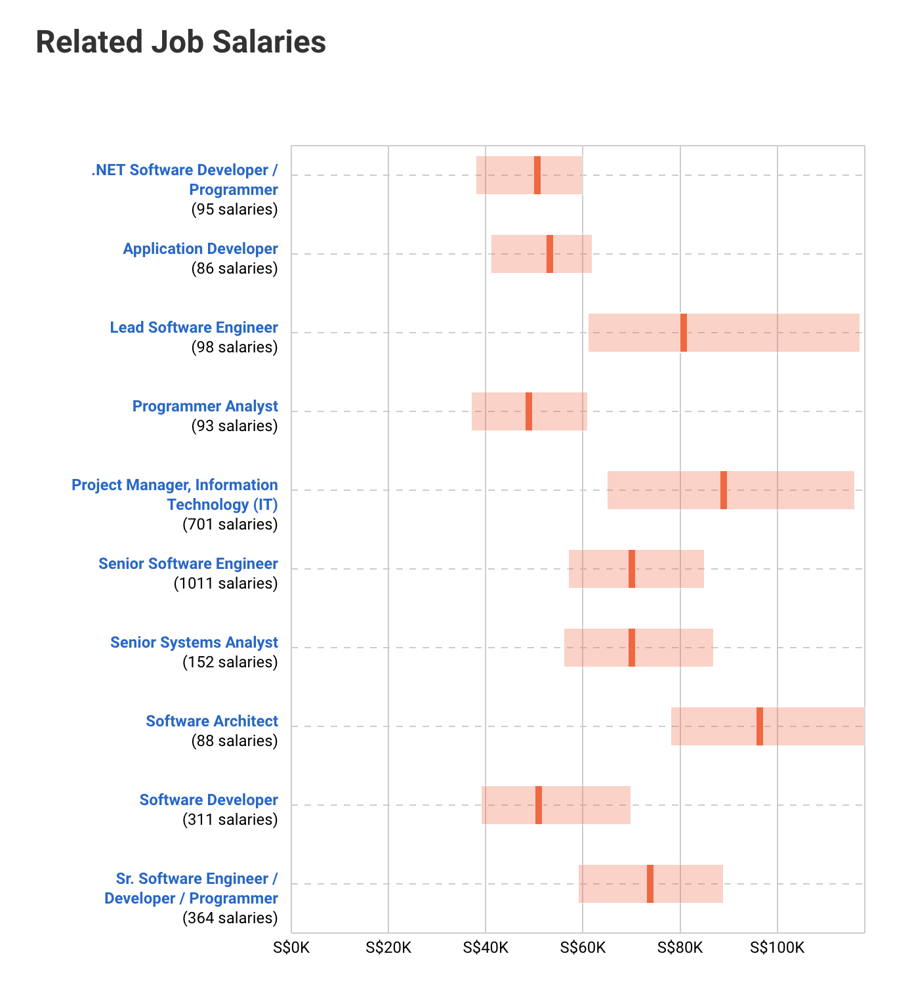

いろいろと誤解を受けそうなタイトルとなってしまっているが、キャリアアップ視点での東南アジア就職に関して私が感じている事を話す。

<!--more-->

#### 目次
1. <a href="#結局現地の日系企業で働く">結局現地の日系企業で働く</a>
2. <a href="#現地の日系企業から外資系企業へのキャリアアップが難しい">現地の日系企業から外資系企業へのキャリアアップが難しい</a>
3. <a href="#シンガポールに関しては例外か？">シンガポールに関しては例外か？</a>
4. <a href="#少ないながらもキャリアアップの希望はあるかもしれない">少ないながらもキャリアアップの希望はあるかもしれない</a>

## 結局現地の日系企業で働く

人ぞれぞれ海外就職の目的は違うと思うが、私は外国人が多くいる環境で働きたいと思っていた。しかし、所詮私が働いているのはタイの日系企業で、日本人は沢山いるし、協力会社も日系企業な場合が多い。何が不満なのかというと、「これじゃ日本で働いてるのとあんまり変わらないな」という感覚。もちろんタイ人とも英語でコミュニケーションを取る機会は多い。しかし、日本語と英語を話してる機会どっちが多いのと聞かれたら、日本語を話してる方が多いのは間違いない。

そんな中でも良かったなと思える部分は資料・スライド作成、メッセンジャーツール、メールなどは全て英語になってる事だ。英語でのメールの書き方などは多分日本にいたままでは分からなかっただろう。

では思い切って、「バンコクで外国人Onlyの会社に転職すれば良いじゃん」と思うかもしれない。しかし、東南アジアの現地の給与はそこまで高くないというのが現状。所詮私の今の給与など日系企業という事で下駄を履かせてもらっているだけで、日本人プレゼンスを失えばあっという間に下がる。

## 現地の日系企業から外資系企業へのキャリアアップが難しい

海外就職で外資系企業（非日系）企業に就職する道として一番リスクが少なく達成しやすい黄金パターンは以下だと思う。

1. 現地の日系企業に駐在員として送り込まれる or 現地の日系企業に就職する
2. 環境に慣れている間に、その土地でコネクションを作り条件や環境の良い外資系企業に転職する

東南アジアの場合は２を探すのが明らかに難しい。前節で話したように、もしあなたがキャリアアップを目的に東南アジアに来たのであれば、日本以上の待遇を求めるのは困難を極める。

参考までにバンコクで有名な[Agoda](https://careersatagoda.com/vacancies/)を例に考えてみる。この会社はあまり給与情報を公開していないが、QuoraでAgodaのSenior Software Developerが回答していたので、そこの言葉を信じてみる。

  
  <a href="https://www.quora.com/What-is-the-salary-of-a-software-engineer-in-Agoda-Bangkok-with-5-years-experience-in-Java-JEE" target="_blank">
    <strong class="article-widget-title">What is the salary of a software engineer in Agoda, Bangkok with 5 years experience in Java/JEE?</strong>
    <em class="article-widget-description">Answer: The salary is very similar to equivalent positions on other companies (around 80,000 for locals; around 110,000 for expats). The great thing related to wage</em>
    <em class="article-widget-url">quora.com</em>
  </a>

> The salary is very similar to equivalent positions on other companies (around 80,000 for locals; around 110,000 for expats). The great thing related to wage right from the start is the bonus, which varies depending on a series of factors but can get up to 6x.

給与はその他の会社の同等なポジションに似てる（タイ人だと8万バーツ、外国人だと11万バーツ）。そもそも給与に関して素晴らしいのはボーナスで、多くの要因に依存して変わるが、最大で６ヶ月分になる事もある。

仮にあなたがAgodaのSenior Software Developerで３ヶ月ボーナスが与えられた時の事を考えると、年収は165万バーツ（約580万円）。これを東京のソフトウェアエンジニアが聞いてが聞いて高いか低いかを考えると、おそらく「普通」と答えるのではないか？

今の東京のソフトウェアエンジニアの事情はそこそこ優秀なソフトウェアエンジニアであれば、新卒から2,3年経過して転職すると年収で600万円以上になる事が多い。東京のシニアエンジニアレベルになると800万円以上でスカウトしてくる企業も珍しくなくなってきた。

<blockquote class="twitter-tweet">
エンジニアの新卒は適正不明で当たり外れが大きいので、雇う側が350~400スタートの気持ちはわかるんだけど、使えるとわかった2年目, 3年目は転職市場で500万〜 600万〜の値段がつくのに短期間で昇給するシステムを持つ会社がないので、転職すると市場価値で是正されるのが転職すると150万上がるの話
&mdash; 死後強まるツイート (@mizchi) <a href="https://twitter.com/mizchi/status/1088505957674414080?ref_src=twsrc%5Etfw">January 24, 2019</a></blockquote> 

 

給与の面から言えば、わざわざバンコクに来てソフトウェアエンジニアなどやる意味などない。Agodaはタイの中でも比較的人気な外資系Web系企業だと聞く。当たり前だが、年収は現地の物価や平均年収に左右されるわけで、CTOやCIOなどのCレベルスカウトでもない限り、東京以上に給与を貰えるパターンはほとんどない。

## シンガポールに関しては例外か？

私はシンガポールに関して詳しくないため、良い情報があればむしろ教えて下さいと言いたいところだ。[AngleList](https://angel.co/)や[Glassdoor](https://www.glassdoor.com)を見ると、良い求人が揃っているように見える。また[Payscale](https://www.payscale.com/research/SG/Job=Software_Engineer/Salary)等で確認しても良い感じに見える。

#### AngleList

#### PayScale

## 少ないながらもキャリアアップの希望はあるかもしれない

最後くらいは希望のある話をして終えたい。以前とあるタイの日系のSI・コンサル系の会社の採用責任者と話す機会があり、興味深い話を聞いた。その人曰く優秀なタイ人エンジニアマネージャーを採用するには月給20万バーツ（約70万円）でも取れない事があるらしい。ボーナスも入れるとおそらくは年収1000万円クラスのオファーだ。ちなみにその会社のタイ人エンジニアは日本人と同じレベルの給与をもらっている。

<blockquote class="twitter-tweet">
具体的には30台後半で月給20万バーツでも断られる事があるらしい。
&mdash; バンコクの機械学習エンジニア🇹🇭たまにゃん (@tamanyan55) <a href="https://twitter.com/tamanyan55/status/1094978176227274752?ref_src=twsrc%5Etfw">February 11, 2019</a></blockquote> 

 

これだけ競争力が上がっているのが今のITエンジニアであり、特に課題・タスク管理、気配りの能力などは日本人が得意としている部分だ。こういった強みを活かしながらエンジニアリングマネージャーを目指していくとキャリアアップの道が見えてくるかもしれない。

何にせよ私自身が今後東南アジアのエンジニアとしてどうやって生き残っていくのかを常日頃考えている。胸を張って「東南アジアのエンジニアいいゾ、皆来なよ」と心から言える日が来ると嬉しい。
