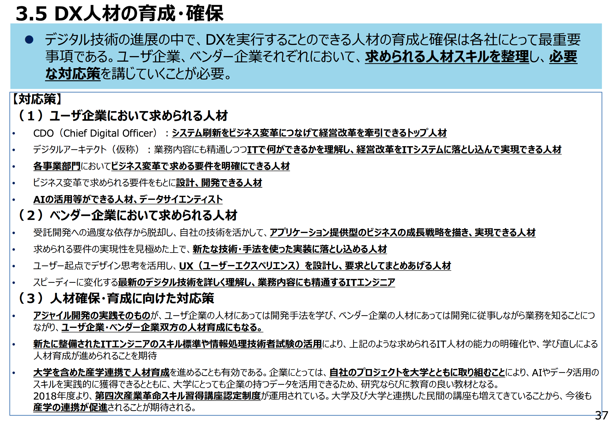

海外の現地採用の雇用形態の話あまりないと思うので、タイ現地採用している私の雇用形態とデジタル人材の需要について話しておこうと思う。

## 雇用形態

自分の雇用契約書に目を通しながら、抵触しない範囲で話していく。他の現地採用の方がどのような契約をしているかは不明であるが、私は1年契約の有期雇用契約の年俸制で契約している。1年ごとに契約更改があり、次年の年俸が決定される。いわばプロ野球選手の様なものと思ってもらって構わない。福利厚生はその会社で規定された健康保険、有給休暇、病気休暇等がある。

<!--more-->

契約内容に関してはかなり柔軟で、給与テーブルのようなものはなく、例えば契約年数も3年にしてくれと言えば通ると思う（ただしVisaやWork Permitの毎年に更新が必要）。契約書が全て。現地の国民（タイ人）と違って、外国人の雇用はペラペラの紙みたいなもので実力や成果を出せないと、契約が終われば切られる事を覚悟した方が良い。日本の正社員で当たり前に得ていた雇用の安定性はなくなり、常に自分のキャリアと向き合う事に迫られる。こう書くと私は何故わざわざ人生ハードモードを選んでいるんだ？と自問自答する時もたまにある。正直エンジニアでなければ絶対にこんな事やってないだろう。

その見返りに、競争力のある人材であれば、企業によっては給与の大幅アップが可能だと思う。全ては交渉次第。自分の専門性に自信があるならば、挑戦するのも良いと思う。

## デジタル人材の需要

BtoCのWeb業界にいる方々はあまり感じていないかもしれないが、昨今、ユーザー企業においてデジタルトランスフォーメーション（DX）を推進するためのデジタル人材が圧倒的に不足している。需要があるのに人がいない。そもそもデジタル人材って何？と言われると様々な解釈があると思うので、経済産業省の[DXレポート～ITシステム「2025年の崖」の克服とDXの本格的な展開～](https://www.meti.go.jp/shingikai/mono_info_service/digital_transformation/pdf/20180907_02.pdf)から引用させてもらうと

> ・CDO（Chief Digital Officer）：システム刷新をビジネス変革につなげて経営改革を牽引できるトップ人材 
> ・デジタルアーキテクト（仮称）：業務内容にも精通しつつITで何ができるかを理解し、経営改革をITシステムに落とし込んで実現できる人材 
> ・各事業部門においてビジネス変革で求める要件を明確にできる人材 
> ・ビジネス変革で求められる要件をもとに設計、開発できる人材 
> ・AIの活用等ができる人材、データサイエンティスト 

いろいろな役割が書いてあるが、要は**ビジネス要件から、先端・デジタル技術を駆使しながらサービスや基盤を設計、開発できる人材**ではないかと思う。この手の人材がユーザー企業に殆どいない。

実はタイでも同じ様な現状が起きていて、IT人材不足に拍車がかかり、他の職種と比べると給与がかなり高騰している。優秀なシニア人材だと人によっては日本と大きく待遇が変わる事はないと思う。特にAI・データ、クラウド技術、UX辺りに精通した方はかなり重宝される。

## 結局何を言いたいのか？

タイはデジタル人材の需要めっちゃあるよ。でも現地採用だと雇用形態はチャレンジングだから人は選ぶよという話である。機会と自信があれば挑戦してみるのも選択肢の一つではないかと思う。

- （なんでわざわざタイ？）自分の場合は行きたい国とオファーが偶然にも重なった結果でした。
- （駐在員でよくない？）駐在員のオファーがあればそちらを選択しても良いと思います。少なくとも雇用の安定性は保証されます。

## 参考資料

- [DXレポート～ITシステム「2025年の崖」の克服とDXの本格的な展開～](https://www.meti.go.jp/shingikai/mono_info_service/digital_transformation/pdf/20180907_02.pdf)

