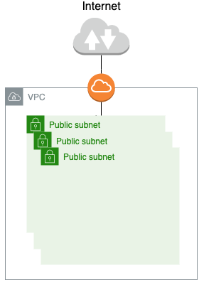
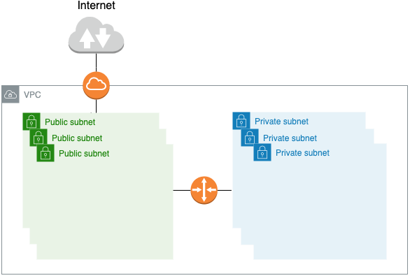
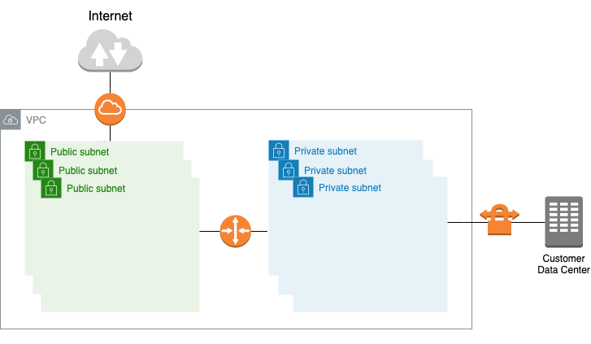
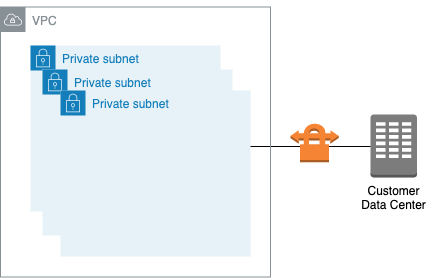
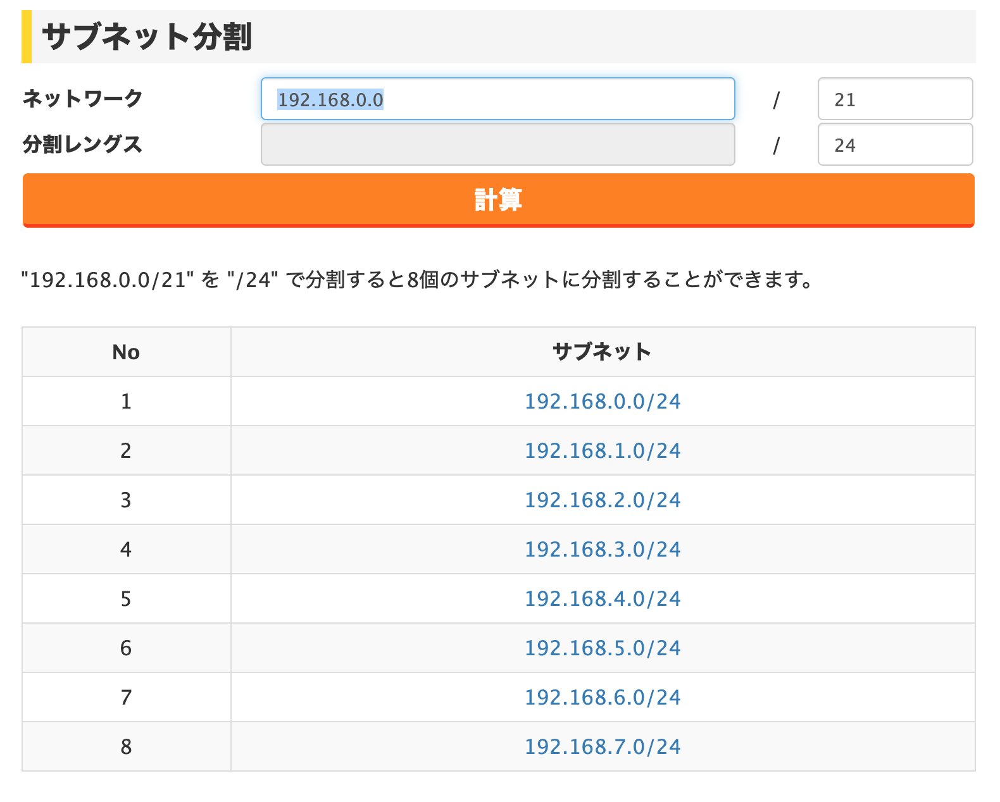

Amazon Virtual Private Cloud (Amazon VPC) は最も基本的なAWSのサービスだが、自由度も高いのでどのように設計をすればよいのか、いつも頭を悩ませる。AWS Single VPC Designを読み込んでベストプラクティスを守るようにする。

## ベストプラクティス

ネットワーク設計を考える時に、まず一般的なネットワーク設計原則を確認する。例えば、プライベートネットワークにオーバーラップしないようにサブネットを実装するのが良い。また将来への拡大に備えて、IPアドレススペースを余分に確保しておく事も良い考えだ。VPCは、次のような設計のベストプラクティスに従う必要がある。

<!--more-->

- VPCネットワークレンジ（CIDRブロック）が他のプライベートネットワーク範囲とオーバーラップしないようにする
- 一度に全てのネットワークアドレスを確保してはいけない、将来に使うことも想定して使えるスペースを残しておく
- 特定のリージョンのすべてのAvailability Zonesに渡って、ネットワークを分ける
- それぞれのルーティング要件（public subnets vs private subnets）に応じて、サブネットをAvailability Zones毎に作成する
- 将来予想されるホストマシンの増加に対して備えるために、 VPCのCIDRとサブネットを適切なサイズで用意する

## AWS上のアプリケーション

VPCの設計を考える時、ユーザー、バックエンドシステム、ルーティングの観点からAWSをどのように活用するかを考えて、同様に現在と将来に必要なネットワークサイズを推定する必要がある。ベストプラクティスを守ってさえいれば、ある構成から別の構成に簡単に変える事も可能。例えば、`Internet-Accessible VPC`にプライベートサブネットを追加することで以下のような`Public and Privately Routed VPC`を作り出す事ができる。しかし、一度作成したVPCとサブネットはリサイズする事はできないという事を覚えておく必要がある。

自分のユースケースに対して適切な構成を選択するには、以下のような条件をもとにデザインパターンを考える。

- User Access: 誰がネットワークのAWSリソースにアクセスするのか？（内部ユーザー、外部ユーザー？）
- Systems Access: 他システム（内部、外部、共有）と連携する必要があるか？
- Routing: それぞれ違った方法でルーティングをするホストが必要か？

これらの条件をもとに以下のデザインパターンを採用する。

### Internet-Accessible VPC

パブリックサブネットのみで構成されたVPC。VPC内のAWSリソースは自社が持つ内部システム及び内部ネットワークとの直接的の接続をできないようにする。

<h4><strong>Usecase</strong></h4>

テスト、R&D、デモ、本番とその他の環境で使われるが、内部ネットワークからは完全に隔離されたネットワークとする。ネットワーク内のAWSリソースが内部へのプライベート通信を持たないようにするケースで適切である。

<h4><strong>User Access</strong></h4>

VPC内にあるAWSリソースにアクセスする際には、全ユーザー（内部・外部）はインターネット越しに利用する。

<h4><strong>Systems Access</strong></h4>

VPC内のAWSリソースはインターネット上の他のパブリックなシステムへのアクセスが許可される。

<h4><strong>Routing</strong></h4>

AWSリソースはすべて同じルーティング要件を共有し、インターネットゲートウェイとAWSが提供するインターネット接続を利用する。

### Public and Privately Routed VPC

パブリックサブネットとプライベートサブネットで構成されたVPC。NATも使用する事も考える。

<h4><strong>Usecase</strong></h4>

このパターンは内部（ブライベート）と外部（パブリット）リソースの両方と通信する必要があるネットワーク構成を作るときに使用される。パブリックとブライベートルーティングの両方に対応する必要があるシステムで最適。例えば、データベース・バックエンドシステムで構築された多層構造Webアプリケーションで有効。

<h4><strong>User Access</strong></h4>

状況によるが、VPC内にあるAWSリソースにアクセスする際には、全ユーザー（内部・外部）はインターネット越しでも内部からでもアクセスできるようにする。

<h4><strong>Systems Access</strong></h4>

VPC内のAWSリソースは内部・外部システムへのアクセスできるようにし、プライベートネットワーク、インターネット接続を利用できるようにする。

<h4><strong>Routing</strong></h4>

パブリックサブネットかプライベートサブネットのどちらにAWSリソースを配置するかをグループ分けして、それぞれが適切にルーティングされるようにする。

### On-Premises and Internet-Accessible VPC

パブリックサブネットとプライベートサブネットと内部システム（VPN接続）で構成されたVPC。

<h4><strong>Usecase</strong></h4>

このパターンはオンプレミス（ブライベート）と外部（パブリット）リソースの両方と通信する必要があるネットワーク構成を作るときに使用される。インターネット越しに内部の顧客システム等にアクセスするWebアプリケーションで等有効。

<h4><strong>User Access</strong></h4>

状況によるが、VPC内にあるAWSリソースにアクセスする際には、全ユーザー（内部・外部）はインターネット越しでも内部からでもアクセスできるようにする

<h4><strong>Systems Access</strong></h4>

VPC内のAWSリソースは内部・外部システムへのアクセスできるようにし、プライベートネットワーク、インターネット接続を利用できるようにする。

<h4><strong>Routing</strong></h4>

パブリックサブネットかプライベートサブネットのどちらにAWSリソースを配置するかをグループ分けして、それぞれが適切にルーティングされるようにする

### Internal-Only VPC

プライベートサブネットと内部システム（VPN接続）で構成されたVPC

<h4><strong>Usecase</strong></h4>

バックオフィスシステムのような内部ユーザーからのアクセスのみを想定したケースで有効。

<h4><strong>User Access</strong></h4>

VPC内にあるAWSリソースにアクセスする際には、全ユーザー（内部・外部）は内部からのみアクセスできるようにする

<h4><strong>Systems Access</strong></h4>

VPC内のAWSリソースは顧客の内部システムにアクセスできるようにする。

<h4><strong>Routing</strong></h4>

AWSリソースはすべて同じルーティング要件を共有し、VPNかAWS Direct Connectを利用して顧客の内部システムと通信できるようにする。

## VPCのサイジング

VPCのサイズは16アドレス（/28 ネットマスク）から65,536（/16 ネットマスク）まで取る事が可能。VPCのサイズはどの程度リソースが必要になるかに応じて、適切なサイズを決める。

<h4><strong>Micro</strong></h4>

- Netmask: /24
- Subnet Size: /27
- Hosts/Subnet*: 27
- Subnets/VPC: 8
- Total IPs*: 2164

<h4><strong>Small</strong></h4>

- Netmask: /21
- Subnet Size: /24
- Hosts/Subnet*: 251
- Subnets/VPC: 8
- Total IPs*: 2008

<h4><strong>Medium</strong></h4>

- Netmask: /19
- Subnet Size: /22
- Hosts/Subnet*: 1019
- Subnets/VPC: 8
- Total IPs*: 8152

<h4><strong>Large</strong></h4>

- Netmask: /18
- Subnet Size: /21
- Hosts/Subnet*: 2043
- Subnets/VPC: 8
- Total IPs*: 16344

<h4><strong>Extra Large</strong></h4>

- Netmask: /16
- Subnet Size: /20
- Hosts/Subnet*: 4091
- Subnets/VPC: 16
- Total IPs*: 65456

\* AWSで事前に予約されたIPアドレスは除外している

例えば以下の[Webサイト](https://www.ipkeisan.com/subnet/?nw=192.168.0.0&len=21&sub=24)で192.168.0.0を`Small`のVPCサイズで分割してみる。
このように8つのサブネットができたので、後はこれを各Availability Zonesやパブリックサブネット、プライベートサブネットとして振り分けていく。

## 参考資料

- [AWS Single VPC Design](https://aws.amazon.com/answers/networking/aws-single-vpc-design/)

